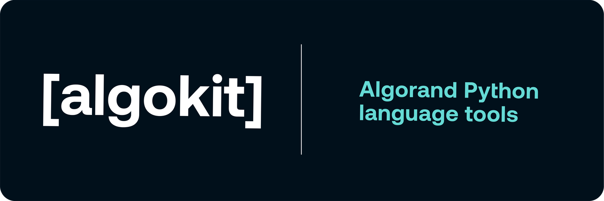

    
    
    
    

---

The Algorand Python language extension brings language server powered capabilities to your smart contract authoring experience in Visual Studio Code. It extends the results from your installed Python language server to provide Algorand Python specific diagnostics and code actions.

This extension depends on the official [Python extension for Visual Studio Code](https://marketplace.visualstudio.com/items?itemName=ms-python.python). We recommending using it in the default configuration with Pylance.

## Features

- Works alongside your installed Python language server
- Automatically discovers the PuyaPy version installed in your project venv
- Algorand Python smart contract-aware code analysis, diagnostics and validation
- IntelliSense and autocompletion for the Algorand Python language
- Quick fixes and code actions for common Algorand Python issues, helping you learn the Algorand Python language as you build

## Requirements

- [Visual Studio Code](https://code.visualstudio.com/download) 1.80.0 or higher
- [Python extension for Visual Studio Code](https://marketplace.visualstudio.com/items?itemName=ms-python.python)
- [Python](https://www.python.org/downloads/) 3.12 or higher
- [PuyaPy](https://pypi.org/project/puyapy/) x.y.z or higher

## Quick Start

1. Install the [Python extension for Visual Studio Code](https://marketplace.visualstudio.com/items?itemName=ms-python.python)
1. Install this Algorand Python language extension
1. Install the [PuyaPy](https://pypi.org/project/puyapy/) package on your system. We recommend installing as a project dev dependency in your project venv.
1. Open a Python smart contract file (.py)
1. The extension will automatically activate for Python files in your Algorand Python smart contract project

## Configuration

This extension exposes the following settings:

- `algorandPython.languageServerPath`: An absolute path to the [PuyaPy](https://pypi.org/project/puyapy/) package location on your system (e.g. `/Users/me/.local/bin/`). The PuyaPy package ships the language server component, which this extension leverages. If blank, the extension will try to automatically resolve the most applicable PuyaPy package available on your system.

## Working with Python Smart Contracts

The extension works alongside the standard Python language server to provide additional Algorand-specific features:

- Smart contract validation and verification
- ABI method completion and validation
- Transaction types and fields autocompletion
- Built-in type checking for Algorand smart contract patterns

## Troubleshooting

If you encounter any issues:

1. Ensure both Python and Algorand Python extensions are installed
2. Check the "Output" panel in VS Code and select "Algorand Python" from the dropdown
3. Verify your Python environment is correctly configured

## Contributing

This extension is open source and accepts contributions. Please visit our [GitHub repository](https://github.com/algorandfoundation/algokit-language-vscode) for more information.

## License

This extension is licensed under the Apache License 2.0. See the [LICENSE](LICENSE) file for more details.
